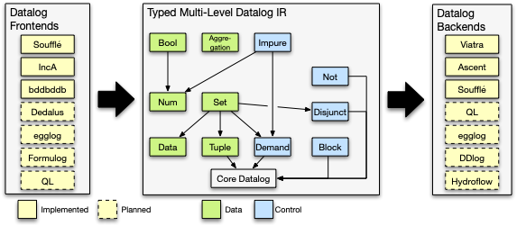

# IncA

## Overview

IncA is a compiler framework for Datalog that can be used to support any Datalog frontend language and to target any Datalog backend.
The centerpiece of IncA is a typed multi-level Datalog IR that supports IR extensions and guarantees executability. 
Existing Datalog systems can provide a compiler frontend that translates their Datalog dialect to the extended IR. 
The IR is then progressively lowered toward core Datalog, allowing optimizations at each level.

## Getting Started
To build, install the [sbt](https://www.scala-sbt.org) build tool and run `sbt compile` from the root directory of the project.

To execute the provided tests run `sbt test` from the root directory.

## Frontends
IncA supports multiple frontends that are translated to a common Datalog multi-level IR.
All frontends ship with their own parser and thus do not require additional setup.

- [**bddbddb**](https://bddbddb.sourceforge.net): Untested.
- [**Soufflé**](https://souffle-lang.github.io): Stable, limited feature set.
- [**Functional IncA**](https://www.pl.informatik.uni-mainz.de/files/2022/06/functional-datalog.pdf): Stable.
- [**OODL**](): Experimental.
- **Datalog**: Stable, limited feature set.

## Backends
To use a backend, the corresponding backend needs to be installed first.

- [**Viatra**](https://eclipse.dev/viatra/): No additonal setup required.
- [**Soufflé**](https://souffle-lang.github.io): Install the latest [Soufflé command line tools](https://souffle-lang.github.io/install).
- [**Ascent**](https://s-arash.github.io/ascent/): Install the latest [Rust toolchain](https://www.rust-lang.org/tools/install).

## Publications
IncA is a research project, and its various features have been documented in the following publications:
* **A Typed Multi-level Datalog IR and Its Compiler Framework**, David Klopp, Sebastian Erdweg and André Pacak.
  In *Proceedings of the ACM on Programming Languages (OOPSLA)*. ACM, 2024. [[pdf]](https://www.pl.informatik.uni-mainz.de/files/2024/10/datalog-ir.pdf)

* **Object-Oriented Fixpoint Programming with Datalog**, David Klopp, Sebastian Erdweg and André Pacak.
  In *Proceedings of the ACM on Programming Languages (OOPSLA)*. ACM, 2024. [[pdf]](https://www.pl.informatik.uni-mainz.de/files/2024/10/datalog-oop.pdf)

* **Separate Compilation and Partial Linking: Modules for Datalog IR**, David Klopp, André Pacak, and Sebastian Erdweg.
  In *Proceedings of Generative Programming: Concepts & Experiences (GPCE)*. ACM, 2024. [[pdf]](https://www.pl.informatik.uni-mainz.de/files/2024/10/datalog-modules.pdf)

* **Incremental Processing of Structured Data in Datalog**, André Pacak, Tamás Szabó, and Sebastian Erdweg.
In *Proceedings of Generative Programming: Concepts & Experiences (GPCE)*. ACM, 2022. [[pdf]](https://www.pl.informatik.uni-mainz.de/files/2022/11/incremental-structured-data.pdf)

* **Functional Programming with Datalog**, André Pacak and Sebastian Erdweg.
In *Proceedings of European Conference on Object-Oriented Programming (ECOOP)*. 2022. [[pdf]](https://www.pl.informatik.uni-mainz.de/files/2022/06/functional-datalog.pdf)

* **Incremental Whole-Program Analysis in Datalog**, Tamás Szabó, Sebastian Erdweg, and Gábor Bergmann.
In *Proceedings of Conference on Programming Languages Design and Implementation (PLDI)*, 2021. [[pdf]](https://www.pl.informatik.uni-mainz.de/files/2021/06/inca-whole-program.pdf)

* **Concise, Type-Safe, and Efficient Structural Diffing**, Sebastian Erdweg, Tamás Szabó, and André Pacak.
In *Proceedings of Conference on Programming Languages Design and Implementation (PLDI)*, 2021. [[pdf]](https://www.pl.informatik.uni-mainz.de/files/2021/06/truediff.pdf)

* **A Systematic Approach to Deriving Incremental Type Checkers**, André Pacak, Sebastian Erdweg, and Tamás Szabó.
In *Proceedings of the ACM on Programming Languages (OOPSLA)*. 2020. [[pdf]](https://www.pl.informatik.uni-mainz.de/files/2020/10/incremental-typing-foundations.pdf)

* **Incrementalizing Lattice-Based Program Analyses in Datalog**, Tamás Szabó, Gábor Bergmann, Sebastian Erdweg, and Markus Völter.
In *Proceedings of Conference on Object-Oriented Programming, Systems, Languages, and Applications (OOPSLA)*, 2018. [[pdf]](https://szabta89.github.io/publications/inca-oopsla.pdf)

* **Incremental Overload Resolution in Object-Oriented Programming Languages**, Tamás Szabó, Edlira Kuci, Matthijs Bijman, Mira Mezini, and Sebastian Erdweg.
In *Proceedings of International Workshop on Formal Techniques for Java-like Programs (FTfJP)*, 2018. [[pdf]](https://szabta89.github.io/publications/inca-ftfjp.pdf)

* **IncA: A DSL for the Definition of Incremental Program Analyses**, Tamás Szabó, Sebastian Erdweg, and Markus Völter.
In *Proceedings of International Conference on Automated Software Engineering (ASE)*, 2016. [[pdf]](https://szabta89.github.io/publications/inca-ase.pdf)

## Project Team
The IncA project is led by [David Klopp](https://www.pl.informatik.uni-mainz.de/team/), [André Pacak](https://andrepacak.de) and [Sebastian Erdweg](https://www.pl.informatik.uni-mainz.de/erdweg) at the PL research group of [JGU Mainz](https://www.pl.informatik.uni-mainz.de). [Tamas Szabó](https://szabta89.github.io/) and [Gábor Bergmann](https://inf.mit.bme.hu/en/members/bergmann) have significantly contributed to the development of IncA.
