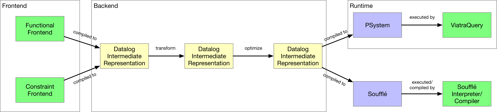

# IncA
## Overview
IncA is a program analysis framework. The framework provides two DSLs for defining program analyses and a runtime system that evaluates program analyses incrementally to achieve the performance that is needed for real-time feedback in IDEs. When code gets changed, the IncA runtime system incrementally updates analysis results instead of the repeated recomputation from scratch.

## Getting Started
To build, install the [sbt](https://www.scala-sbt.org) build tool and run `sbt compile` from the root directory of the project.

To execute the provided tests run `sbt test` from the root directory.

### Architecture
The IncA project has the following architecture:

The frontends, backend and runtime can be found in the respective packages:
- `inca.frontend`
- `inca.backend`
- `inca.runtime`

### Frontend
IncA has two different DSLs for defining program analyses:
- A functional frontend inspired by functional programming
- A constraint-based frontend inspired by logic programming

We translate the two frontends to a Datalog intermediate representation (`inca.backend.ir`). The compiler of the functional frontend can be found in the package `inca.frontend.functional`, whereas `inca.frontend.constraint` contains the compiler for the constraint-based frontend.

The test package `inca.examples.functional` contains example programs for the functional frontend whereas `inca.examples.constraint` provides examples using the constraint-based frontend.

To execute a program of the functional frontend, we provide a `FunctionalExecutor` found in the package `inca.frontend.functional.executor`. The file `inca.frontend.integration.FunctionsTest` shows how to use the `FunctionalExecutor`.

To execute a program of the constraint-based frontend we provide a `ConstraintExecutor` found in the package `inca.frontend.constraint.executor`. The usages of `ConstraintExecutor` can be seen in:
- `inca.frontend.examples.constraint.BinaryTreeExamples`
- `inca.frontend.examples.constraint.GraphExamples`.

### Backend
The backend consists of the following:
- a Datalog dialect used as a intermediate representation (`inca.backend.ir`)
- optimizations of the IR (`inca.backend.optimize`)
- transformations of the IR necessary when compiling the functional frontend (`inca.backend.transform`)
- analysis of the IR (`inca.backend.analyze`)

### Runtime
The runtime of IncA allows to evaluate program analyses incrementally. We store the structure of the subject program (program we run program analyses against) in a database (`inca.runtime.db.Database`). After changing the subject program we need to notify the database about the changes. We use the structural diffing algorithm [truediff](https://gitlab.rlp.net/plmz/truediff) to detect changes in the subject program. These changes are described by an edit script. We process the edit script to precisely notify the Database how the subject program changed. The Database then notifies [ViatraQuery](https://wiki.eclipse.org/VIATRA/Query) to propagate the changes accordingly to update the analysis result.

### Generate Soufflé
Additionally, IncA analyses written in the functional frontend can be compiled to the Datalog dialect of [Soufflé](https://souffle-lang.github.io/). This allows us to utilize the efficient and scalable Datalog solver provided by Soufflé. The compiler that targets Soufflé can be found at `inca.backend.souffle.CompiledFunctionalToSouffleModule` in the sub-project `souffle-frontend`. The test class `inca.backend.souffle.TestGenerateSouffle` in the sub-project `souffle-frontend` shows an example to use the compiler that generate a Soufflé
program based on an analysis written in the functional frontend.

## Publications
IncA is a research project, and its various features have been documented in the following publications:
* **Functional Programming with Datalog**, André Pacak and Sebastian Erdweg.
In *Proceedings of European Conference on Object-Oriented Programming (ECOOP)*. 2022. [[pdf]](https://www.pl.informatik.uni-mainz.de/files/2022/06/functional-datalog.pdf)

* **Incremental Whole-Program Analysis in Datalog**, Tamás Szabó, Sebastian Erdweg, and Gábor Bergmann.
In *Proceedings of Conference on Programming Languages Design and Implementation (PLDI)*, 2021. [[pdf]](https://www.pl.informatik.uni-mainz.de/files/2021/06/inca-whole-program.pdf)

* **Concise, Type-Safe, and Efficient Structural Diffing**, Sebastian Erdweg, Tamás Szabó, and André Pacak.
In *Proceedings of Conference on Programming Languages Design and Implementation (PLDI)*, 2021. [[pdf]](https://www.pl.informatik.uni-mainz.de/files/2021/06/truediff.pdf)

* **A Systematic Approach to Deriving Incremental Type Checkers**, André Pacak, Sebastian Erdweg, and Tamás Szabó.
In *Proceedings of the ACM on Programming Languages (OOPSLA)*. 2020. [[pdf]](https://www.pl.informatik.uni-mainz.de/files/2020/10/incremental-typing-foundations.pdf)

* **Incrementalizing Lattice-Based Program Analyses in Datalog**, Tamás Szabó, Gábor Bergmann, Sebastian Erdweg, and Markus Völter.
In *Proceedings of Conference on Object-Oriented Programming, Systems, Languages, and Applications (OOPSLA)*, 2018. [[pdf]](https://szabta89.github.io/publications/inca-oopsla.pdf)

* **Incremental Overload Resolution in Object-Oriented Programming Languages**, Tamás Szabó, Edlira Kuci, Matthijs Bijman, Mira Mezini, and Sebastian Erdweg.
In *Proceedings of International Workshop on Formal Techniques for Java-like Programs (FTfJP)*, 2018. [[pdf]](https://szabta89.github.io/publications/inca-ftfjp.pdf)

* **IncA: A DSL for the Definition of Incremental Program Analyses**, Tamás Szabó, Sebastian Erdweg, and Markus Völter.
In *Proceedings of International Conference on Automated Software Engineering (ASE)*, 2016. [[pdf]](https://szabta89.github.io/publications/inca-ase.pdf)

## Project Team
The IncA project is led by [André Pacak](https://andrepacak.de) and [Sebastian Erdweg](https://www.pl.informatik.uni-mainz.de/erdweg) at the PL research group of [JGU Mainz](https://www.pl.informatik.uni-mainz.de). [Tamas Szabó](https://szabta89.github.io/) and [Gábor Bergmann](https://inf.mit.bme.hu/en/members/bergmann) have significantly contributed to the development of IncA.
